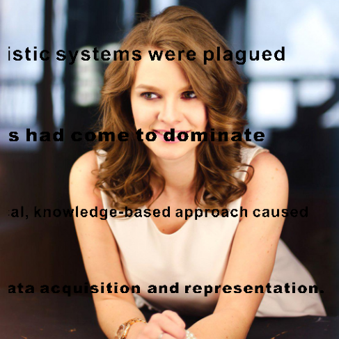
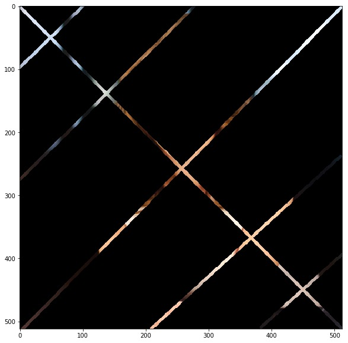
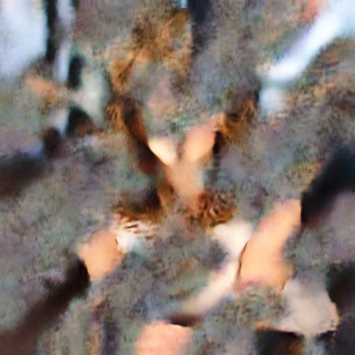
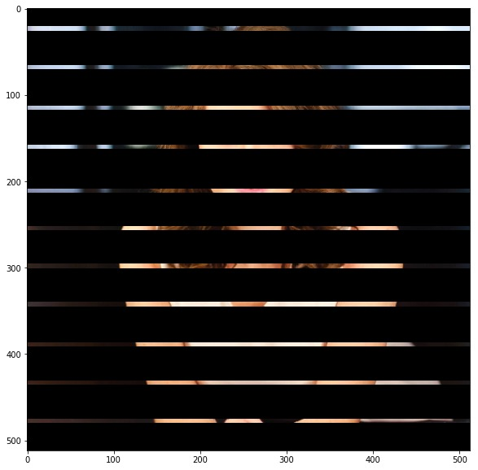
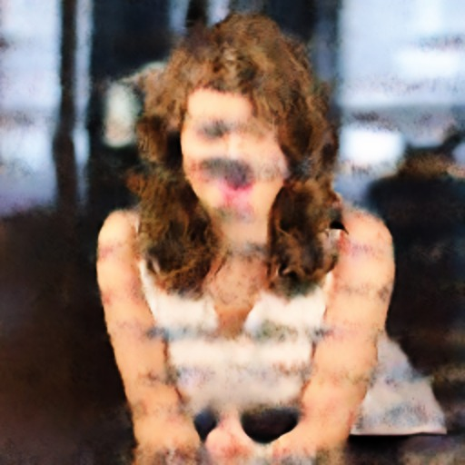
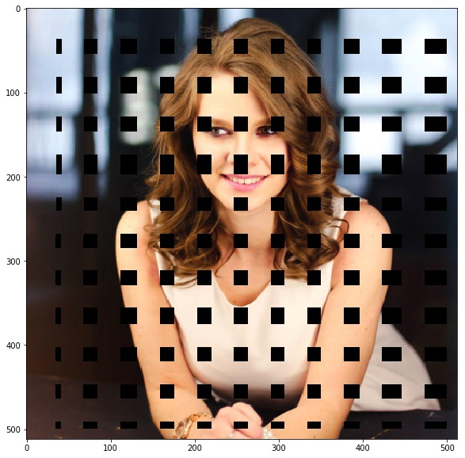
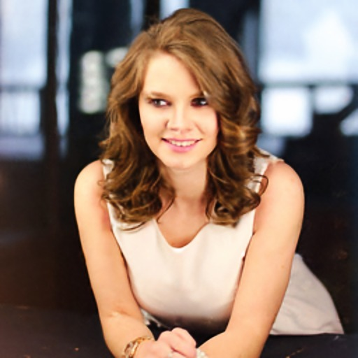
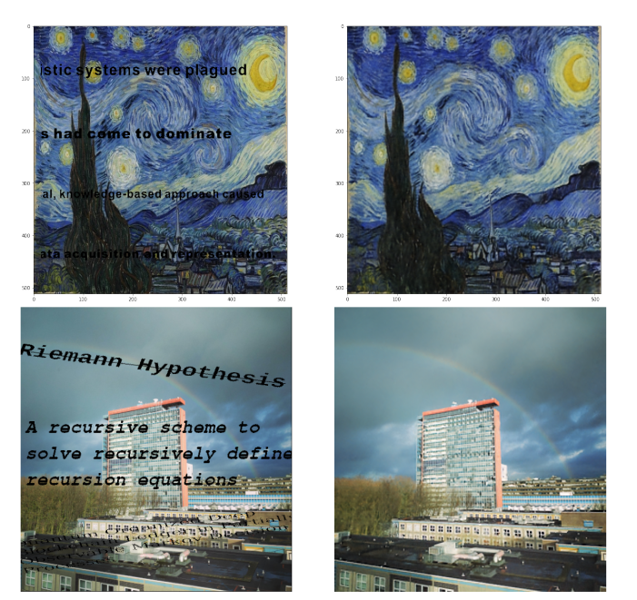
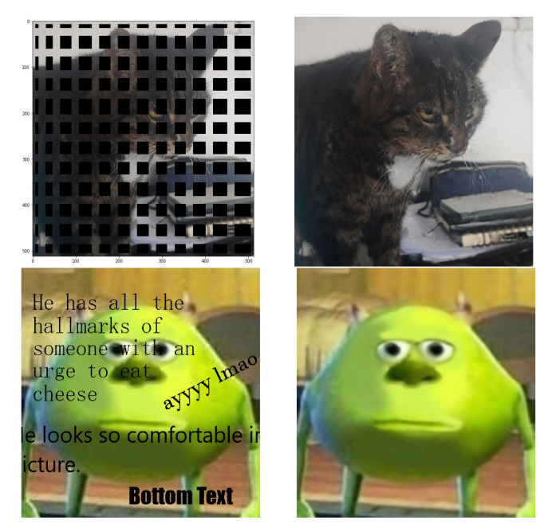

## Introduction


The [Deep Image Prior](https://en.wikipedia.org/wiki/Deep_Image_Prior) is a convolutional neural network (CNN), designed to solve
various inverse problems in computer vision, such as denoising, inpainting and super-resolution. Unlike other CNNs designed for these kinds of tasks, the Deep Image Prior does not need any training data, besides the corrupted input image itself. Generally speaking, the network is trained to reconstruct the corrupted image from noise. However, since the architecture of the Deep Image Prior fits structured (natural) data a lot faster than random noise, one can observe that in many applications recovering the noiseless image can be done by stopping the training process after a predefined number of iterations. The authors of the paper ([Ulyanov et al.](https://arxiv.org/abs/1711.10925)) explain this as follows:

> [...] although in the limit the parametrization can fit un-
structured noise, it does so very reluctantly. In other words,
the parametrization offers high impedance to noise and low
impedance to signal.

This page features an independent reproduction of some of the results published in the original paper, without making use of the already available open-source code. We will describe the design steps that were necessary to get the architecture running and we will explain which ambiguities had to be resolved when interpreting the text material provided by the authors.

## The Network Architecture
The network architecture consists of several convolutional downsampling blocks followed by convolutional upsampling blocks. Furthermore, after each downsampling block a skip connection is added, which links to a corresponding upsampling layer. For a small visualization, see the figure below (taken from the authors [Supplementary Materials](https://box.skoltech.ru/index.php/s/ib52BOoV58ztuPM#pdfviewer)).


We reimplemented this in Python 3, making use of the PyTorch framework. To do so, we separately defined one Module Class for each of these blocks. For the full source-code, you can download and experiment with the Jupyter Notebooks attached in the Notebooks directory of this Git repository.

First of all, the downsampling blocks work as follows:

```python
class Model_Down(nn.Module):
    """
    Convolutional (Downsampling) Blocks.

    nd = Number of Filters
    kd = Kernel size

    """
    def __init__(self,in_channels, nd = 128, kd = 3, padding = 1, stride = 2):
        super(Model_Down,self).__init__()
        self.padder = nn.ReflectionPad2d(padding)
        self.conv1 = nn.Conv2d(in_channels = in_channels, out_channels = nd, kernel_size = kd, stride = stride)
        self.bn1 = nn.BatchNorm2d(nd)

        self.conv2 = nn.Conv2d(in_channels = nd, out_channels = nd, kernel_size = kd, stride = 1)
        self.bn2 = nn.BatchNorm2d(nd)

        self.relu = nn.LeakyReLU()

    def forward(self, x):
        x = self.padder(x)
        x = self.conv1(x)
        x = self.bn1(x)
        x = self.relu(x)
        x = self.padder(x)
        x = self.conv2(x)
        x = self.bn2(x)
        x = self.relu(x)
        return x

```
As we can see, based on the papers default architecture, we default set the number of filters to 128 with a kernel size of 3. We incorporated the downsampling in the convolutional layer with by using the implemented strides of 2. This is also what the authors describe in the supplementary materials.

Furthermore, we defined the upsampling blocks work as follows:
```python
class Model_Up(nn.Module):
    """
    Convolutional (Upsampling) Blocks.

    nu = Number of Filters
    ku = Kernel size

    """
    def __init__(self, in_channels = 132, nu = 128, ku = 3):
        super(Model_Up, self).__init__()
        self.bn1 = nn.BatchNorm2d(in_channels)
        self.padder = nn.ReflectionPad2d(1)
        self.conv1 = nn.Conv2d(in_channels = in_channels, out_channels = nu, kernel_size = ku, stride = 1, padding = 0)
        self.bn2 = nn.BatchNorm2d(nu)

        self.conv2 =  nn.Conv2d(in_channels = nu, out_channels = nu, kernel_size = 1, stride = 1, padding = 0)
        self.bn3 = nn.BatchNorm2d(nu)

        self.relu = nn.LeakyReLU()

    def forward(self,x):
        x = self.bn1(x)
        x = self.padder(x)
        x = self.conv1(x)
        x = self.bn2(x)
        x = self.relu(x)
        x = self.conv2(x)
        x = self.bn3(x)
        x = self.relu(x)
        x = F.interpolate(x, scale_factor = 2, mode = 'bicubic')
        return x

```
The input channels have to match the number of output channels from the last upsampling block plus the number of output channels of the skip connections (since we concatenate the skip connections with the upsampling blocks, for an explanation see the ambiguity section). In the default architecture, this will always be 132, but can of course be manually defined differently, when needed. Initially, we implemented the upsampling blocks using the bilinear upsampling. Nevertheless, we realized that for a high number of iterations (around 8000) the network sturcture performs better with bicubic upsampling.
The upscaling factor of 2 is chosen to match the stride 2 downsampling. This way, we obtain an output image of the same width and height as the input noise.

Meanwhile, we defined the skip blocks in the following way:
```python
class Model_Skip(nn.Module):
    """
    Skip Connections
    ns = Number of filters
    ks = Kernel size
    """
    def __init__(self,in_channels = 128 ,stride = 1 , ns = 4, ks = 1, padding = 0):
        super(Model_Skip, self).__init__()
        self.conv = nn.Conv2d(in_channels = in_channels, out_channels = ns, kernel_size = ks, stride = stride, padding = padding)
        self.bn = nn.BatchNorm2d(ns)
        self.relu = nn.LeakyReLU()

    def forward(self,x):
        x = self.conv(x)
        x = self.bn(x)
        x = self.relu(x)
        return x
```

Then, the final network can be easily defined, by concatenating the modular building blocks together in the same way as described in the figure above.
```python
class Model(nn.Module):
    def __init__(self, length = 5, in_channels = 32, nu = [128,128,128,128,128] , nd =
                    [128,128,128,128,128], ns = [4,4,4,4,4], ku = [3,3,3,3,3], kd = [3,3,3,3,3], ks = [1,1,1,1,1]):
        super(Model,self).__init__()
        assert length == len(nu), 'Hyperparameters do not match network depth.'

        self.length = length

        self.downs = nn.ModuleList([Model_Down(in_channels = nd[i-1], nd = nd[i], kd = kd[i]) if i != 0 else
                                        Model_Down(in_channels = in_channels, nd = nd[i], kd = kd[i]) for i in range(self.length)])

        self.skips = nn.ModuleList([Model_Skip(in_channels = nd[i], ns = ns[i], ks = ks[i]) for i in range(self.length)])

        self.ups = nn.ModuleList([Model_Up(in_channels = ns[i]+nu[i+1], nu = nu[i], ku = ku[i]) if i != self.length-1 else
                                        Model_Up(in_channels = ns[i], nu = nu[i], ku = ku[i]) for i in range(self.length-1,-1,-1)]) #Elements ordered backwards

        self.conv_out = nn.Conv2d(nu[0],3,1,padding = 0)
        self.sigm = nn.Sigmoid()

    def forward(self,x):
        s = [] #Skip Activations

        #Downpass
        for i in range(self.length):
            x = self.downs[i].forward(x)
            s.append(self.skips[i].forward(x))

        #Uppass
        for i in range(self.length):
            if (i == 0):
                x = self.ups[i].forward(s[-1])
            else:
                x = self.ups[i].forward(torch.cat([x,s[self.length-1-i]],axis = 1))

        x = self.sigm(self.conv_out(x)) #Squash to RGB ([0,1]) format
        return x

```


## Preprocessing (Inpainting)

In order to analyze the image correctly and succeed in the inpainting task, we needed to preprocess the original image and the mask. Indeed, our code takes as inputs the original image and the mask that needs to be placed on it. First of all, the images have been converted to numerical arrays and their sizes have been adjusted in such a way that they were compatible. Furthermore, the two numpy arrays have been converted to PyTorch tensors. The masked image will then be given by the normalized multiplication of the torch tensors corresponding to the masked image and the original one.

```python
im = Image.open('kate.png')
maskim = Image.open('kate_mask.png')
maskim = maskim.convert('1')

im_np = np.array(im)
mask_np = np.array(maskim,dtype = float)
mask_np = (np.repeat(mask_np[:,:,np.newaxis], 3, axis = 2)/255)

fig, ax = plt.subplots(figsize=(10,10))
plt.imshow(im_np*mask_np)

mask_tensor = torch.from_numpy(mask_np).permute(2,0,1)
im_tensor = torch.from_numpy(im_np).permute(2,0,1)

im_masked_tensor = ((mask_tensor*im_tensor).unsqueeze(0)/255).cuda()
mask_tensor = mask_tensor.unsqueeze(0).cuda()
```


## Preprocessing (Restoration)

The preprocessing steps used in the restoration task are very similar to the ones used in the inpainting task. Since the restoration task is to recover an image, where a certain percentage (e.g. 50%) of the original image pixels have been dropped, we simply initialized a sparse array with half of the entries being equal to 0 and used that as our mask in the same way as in the inpainting task.

```python
from scipy.sparse import random
mask_np = random(512,512,0.5,dtype = bool).A.astype(float)
```


## Training the Model

The main loop follows the standard Pytorch conventions. The only difference here is that the input to the loss function must be carefully chosen to prevent cheating. We are only allowed to compute the loss on the masked pixels, which ensures that we do not need the original image to begin with. To ensure this, we just multiply the mask with the original image before we pass it to the loss function. The input is, as suggested by the authors, a uniformly generated tensor with mean 0.05.

```python
#Initialize model params
z = (0.1) * torch.rand((1,32,512,512), device = "cuda")


#Initialize the Model
net = Model() #Using standard architecture, no hyperparams specified
optimizer = torch.optim.Adam(net.parameters(),lr = 0.01)

use_gpu = torch.cuda.is_available()

if use_gpu:
    net = net.cuda()


#Main Training Loop
for epoch in range(2000):
    optimizer.zero_grad()
    output = net.forward(z)
    loss = F.mse_loss(output*mask_tensor, im_masked_tensor)

    if (epoch % 250 == 0):
      print('EPOCH: ' + str(epoch))
      print('LOSS: ' + str(loss.item()), end ='\n\n')
      plt.imshow(output.cpu().view(3,512,512).permute(1,2,0).detach().numpy())
      plt.show()

    loss.backward()
    optimizer.step()

    z = z + (1/(30))*torch.randn_like(z) #Regularization

plt.imshow(output.cpu().view(3,512,512).permute(1,2,0).detach().numpy())

```
## Ambiguities

Here we will list some of the things that were not completely specified in the supplementary materials. For these implementation details, we either tested out multiple implementations and then took the best performing one or we simply used the implementation that seemed most reasonable to us. Some of these ambiguities are the following:

* For the skip-layers connections, we decided to use  concatenative connections. Initially, we considered using the additive skip connections. However, this would not be compatible with their specified hyperparameters, since the number of output channels on the skip connections would not match the number of input channels in the upsampling modules. We nevertheless tried out both versions and came to the conclusion that the flexibility of freely choosing the amount of channels on the skip connections helps with preventing overfitting to the noise. Since this can only be achieved with concatenative skip connections, we chose to stick to them in the end.

* The input and its perturbations: The authors mention that they perturb the input at each iteration by small noise. However, this can be achieved in two different ways:
  1. Initializing the input tensor before starting training and then in every iteration taking the initial tensor plus additive noise.
  2. Initializing the input tensor before starting training and then in every iteration taking the previous input tensor plus additive noise.

  We tried both versions, and both of them do work in their own way. However, despite our expectations being the other way round, the first version seems to be regularizing too much, whereas the second version does achieve better looking results, while still preventing overfitting to noise sufficiently.

* Upsampling factor and Downsampling strides: It was not completely clear which strides were used in the downsampling process. Obviously, any stride is possible, as long as the dimensions of the image are large enough. However, this does change the performance of the network. Since for their standard architecture with a kernel size of 3 in the downsampling convolutional blocks and a stride of 2 in the first convolutional layer corresponds to exactly halving the image size for a 512x512 input, we went with that. This also makes the implementation a little bit less tedious, since one does not have to explicitly calculate the upscaling factor anymore.

# Inpainting Results

We reconstructed the original inpainting task on an image of Kate (at least that is what the authors called the image file so we'll call her Kate as well). We seem to be getting comparable results, although our architecture seems to benefit from a few more iterations. Furthermore, we also bombarded Kate with large holes to see how much the Deep Image Prior can reconstruct. Obviously this is an almost impossible task, but the network still seems to be able to recover (quite remarkably) some traits of the original image.

|Corrupted                |  Deep Image Prior |
:----------------------------:|:-----------------------------:
  |  
  |  
  |  
  |  


# Restoration Results
The authors of the paper test the restoration task on a variety of images, which can be found in the interactive display of the [Deep Image Prior Page](https://dmitryulyanov.github.io/deep_image_prior). A selection of them can be seen here:


|Barbara                |  Man | Hill |
:----------------:|:----------------:|:----------------:
  |   | 

|Boat                |  Couple | Lena |
:----------------:|:----------------:|:----------------:
  |   | 


Regarding the PSNR scores of the respective images, we seem to be achieving comparable, and sometimes even higher scores than those mentioned in the paper. However, especially on the Barbara picture, we cannot seem to recover all the details just as well. This might be due to the architecture overfitting to the noise. Stopping the training process earlier than suggested in the paper does help with the picture quality and does not change the PSNR significantly though.


The following table compares our PSNR scores with those reported in Table 1 of the original paper:

|Architecture |Barbara|  Man | Lena | Boat | Hill | Couple
:------:|:------:|:------:|:------:|:------:|:------:|:------:
Ours | 32.519 | 32.234 | 35.078 | 32.930 | 33.032 | 32.390
Theirs | 32.22 | 32.20 | 36.16| 33.06 | 32.77 | 32.52

# Alternative images

For these images, we did not do any hyperparameter tuning. Instead we used the standard architecture to see what we get. Surprisingly, inpainting seems to work quite well on a variety of images, although the output is always a little bit blurrier than the original image. To alleviate this issue, more training iterations help. We did not use more than 6000 iterations for any of these images.



Unlike the wind next to EWI, the inpainting result on the building did not really blow us away. The fine detail of the windows get blurred out significantly, especially in the areas behind the text.

One additional application of the Deep Image Prior, which the authors have not thought of, is the restoration of memes and pictures of cats, cause why not:


