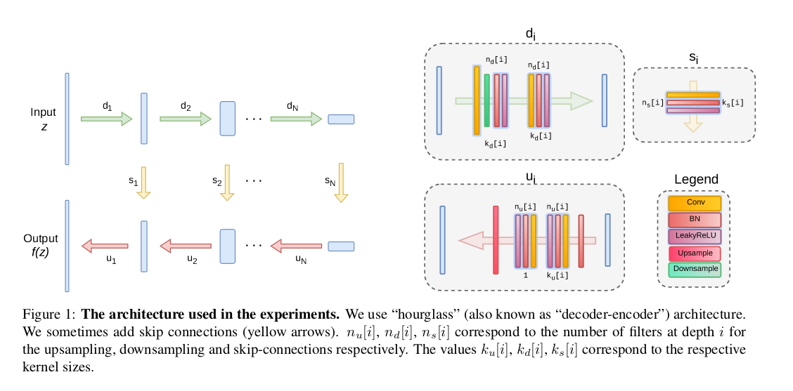

## Introduction


The [Deep Image Prior](https://en.wikipedia.org/wiki/Deep_Image_Prior) is a convolutional neural network (CNN), designed to solve
various inverse problems in computer vision, such as denoising, inpainting and super-resolution. Unlike other CNNs designed for these kinds of tasks, the Deep Image Prior does not need any training data, besides the corrupted input image itself. Generally speaking, the network is trained to reconstruct the corrupted image from noise. However, since the architecture of the Deep Image Prior fits structured (natural) data a lot faster than random noise, one can observe that in many applications recovering the noiseless image can be done by stopping the training process after a predefined number of iterations. The authors of the paper ([Ulyanov et al.](https://arxiv.org/abs/1711.10925)) explain this as follows:

> [...] although in the limit the parametrization can fit un-
structured noise, it does so very reluctantly. In other words,
the parametrization offers high impedance to noise and low
impedance to signal.

This page features an independent reproduction of some of the results published in the original paper, without making use of the already available open-source code. We will describe the design steps that were necessary to get the architecture running and we will explain which ambiguities had to be resolved when interpreting the text material provided by the authors.

## The Network Architecture
The network architecture consists of several convolutional downsampling blocks followed by convolutional upsampling blocks. Furthermore, after each downsampling block a skip connection is added, which links to a corresponding upsampling layer. For a small visualization, see the figure below (taken from the authors [Supplementary Materials](https://box.skoltech.ru/index.php/s/ib52BOoV58ztuPM#pdfviewer)).


We reimplemented this in Python 3, making use of the PyTorch framework. To do so, we separately defined one Module Class for each of these blocks. For the full source-code, you can download and experiment with the Jupyter Notebooks attached in the Notebooks directory of this Git repository.

First of all, the downsampling blocks work as follows: 

```python
class Model_Down(nn.Module):
    """
    Convolutional (Downsampling) Blocks.

    nd = Number of Filters
    kd = Kernel size

    """
    def __init__(self,in_channels, nd = 128, kd = 3, padding = 1, stride = 2):
        super(Model_Down,self).__init__()
        self.padder = nn.ReflectionPad2d(padding)
        self.conv1 = nn.Conv2d(in_channels = in_channels, out_channels = nd, kernel_size = kd, stride = stride)
        self.bn1 = nn.BatchNorm2d(nd)

        self.conv2 = nn.Conv2d(in_channels = nd, out_channels = nd, kernel_size = kd, stride = 1)
        self.bn2 = nn.BatchNorm2d(nd)

        self.relu = nn.LeakyReLU()

    def forward(self, x):
        x = self.padder(x)
        x = self.conv1(x)
        x = self.bn1(x)
        x = self.relu(x)
        x = self.padder(x)
        x = self.conv2(x)
        x = self.bn2(x)
        x = self.relu(x)
        return x

```
As we can see, based on the paper, the number of filters is 128 with a kernel size of 3. We incorporated the downsampling in the convolutional layer with stride of 2.

Furthermore, we defined the upsampling blocks work as follows:
```python
class Model_Up(nn.Module):
    """
    Convolutional (Upsampling) Blocks.

    nu = Number of Filters
    ku = Kernel size

    """
    def __init__(self, in_channels = 132, nu = 128, ku = 3):
        super(Model_Up, self).__init__()
        self.bn1 = nn.BatchNorm2d(in_channels)
        self.padder = nn.ReflectionPad2d(1)
        self.conv1 = nn.Conv2d(in_channels = in_channels, out_channels = nu, kernel_size = ku, stride = 1, padding = 0)
        self.bn2 = nn.BatchNorm2d(nu)

        self.conv2 =  nn.Conv2d(in_channels = nu, out_channels = nu, kernel_size = 1, stride = 1, padding = 0)
        self.bn3 = nn.BatchNorm2d(nu)

        self.relu = nn.LeakyReLU()

    def forward(self,x):
        x = self.bn1(x)
        x = self.padder(x)
        x = self.conv1(x)
        x = self.bn2(x)
        x = self.relu(x)
        x = self.conv2(x)
        x = self.bn3(x)
        x = self.relu(x)
        x = F.interpolate(x, scale_factor = 2, mode = 'bicubic')
        return x

```
As before, the number of inner channels is 128 with kernel size of 3. Initially, we implemented the upsampling blocks using the bilinear upsampling. Nevertheless, we realized that for a high number of iterations (around 8000) the network sturcture performs better with bicubic upsampling.

Meanwhile, we defined the skip blocks in the following way:
```python
class Model_Skip(nn.Module):
    """
    Skip Connections
    ns = Number of filters
    ks = Kernel size
    """
    def __init__(self,in_channels = 128 ,stride = 1 , ns = 4, ks = 1, padding = 0):
        super(Model_Skip, self).__init__()
        self.conv = nn.Conv2d(in_channels = in_channels, out_channels = ns, kernel_size = ks, stride = stride, padding = padding)
        self.bn = nn.BatchNorm2d(ns)
        self.relu = nn.LeakyReLU()

    def forward(self,x):
        x = self.conv(x)
        x = self.bn(x)
        x = self.relu(x)
        return x
```

Lastly, we defined the aggregate model as follows:
```python
class Model(nn.Module):
    def __init__(self):
        super(Model,self).__init__()
        self.d1 = Model_Down(in_channels = 32)
        self.d2 = Model_Down(in_channels = 128)
        self.d3 = Model_Down(in_channels = 128)
        self.d4 = Model_Down(in_channels = 128)
        self.d5 = Model_Down(in_channels = 128)

        self.s1 = Model_Skip()
        self.s2 = Model_Skip()
        self.s3 = Model_Skip()
        self.s4 = Model_Skip()
        self.s5 = Model_Skip()

        self.u5 = Model_Up(in_channels = 4)
        self.u4 = Model_Up()
        self.u3 = Model_Up()
        self.u2 = Model_Up()
        self.u1 = Model_Up()

        self.conv_out = nn.Conv2d(128,3,1,padding = 0)
        self.sigm = nn.Sigmoid()

    def forward(self,x):
        x = self.d1.forward(x)
        s1 = self.s1.forward(x)
        x = self.d2.forward(x)
        s2 = self.s2.forward(x)
        x = self.d3.forward(x)
        s3 = self.s3.forward(x)
        x = self.d4.forward(x)
        s4 = self.s4.forward(x)
        x = self.d5.forward(x)
        s5 = self.s5.forward(x)
        x = self.u5.forward(s5)
        x = self.u4.forward(torch.cat([x,s4],axis = 1))
        x = self.u3.forward(torch.cat([x,s3],axis = 1))
        x = self.u2.forward(torch.cat([x,s2],axis = 1))
        x = self.u1.forward(torch.cat([x,s1],axis = 1))
        x = self.sigm(self.conv_out(x))
        return x
```
For the skip-layers connections, we decided to use concatenative connections. Initially, we considered using the additive skip connection, but because of the dimensions and the results we decided that the concatenative ones were the best in this case.

In order to analyze the image correctly and succed in the inpainting task, we needed to preprocess the original image and the mask. Indeed, our code takes as inputs the original image and the mask that needs to be placed on it. First of all, the images have been converted to numerical arrays and their sizes have been adjusted in such a way that they were compatible. Furthermore, the two numpy arrays have been converted to PyTorch tensors. The masked image will then be given by the normalized multiplication of the torch tensors corresponding to the masked image and the original one.

```python
im = Image.open('kate.png')
maskim = Image.open('kate_mask.png')
im = im.convert('RGB')
maskim = maskim.convert('1')
im_np = np.array(im)
mask_np = np.array(maskim,dtype = float)
mask_np = (np.repeat(mask_np[:,:,np.newaxis], 3, axis = 2)/255)
fig, ax = plt.subplots(figsize=(10,10))
plt.imshow(im_np*mask_np)
mask_tensor = torch.from_numpy(mask_np).permute(2,0,1)
im_tensor = torch.from_numpy(im_np).permute(2,0,1)
im_masked_tensor = (mask_tensor*im_tensor).unsqueeze(0)/255
mask_tensor = mask_tensor.unsqueeze(0)
im_masked_tensor = torch.tensor(im_masked_tensor)
mask_tensor = torch.tensor(mask_tensor)
```


